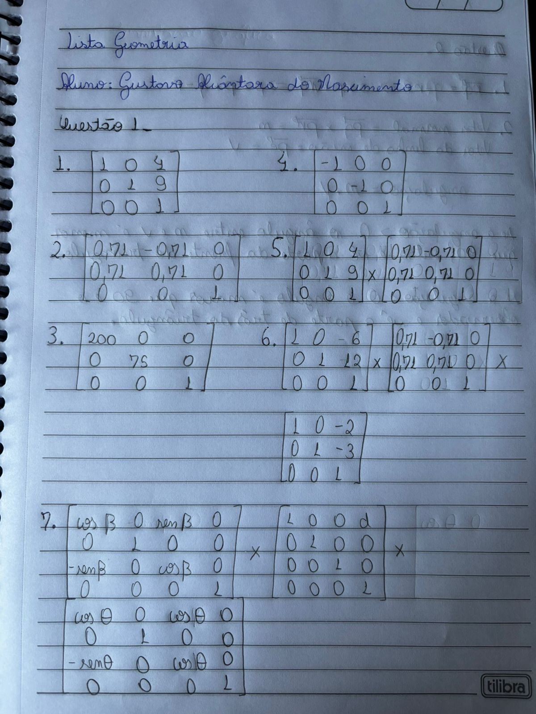
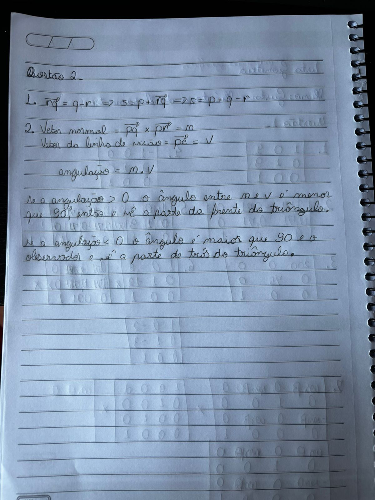

# Lista de Geometria

Lista de Geometria da disciplina de Computação Gráfica

## Questões

---

### Questão 1

	

<em>Resposta da Questão 1.</em>

---

### Questão 2

	

<em>Resposta da Questão 2.</em>

